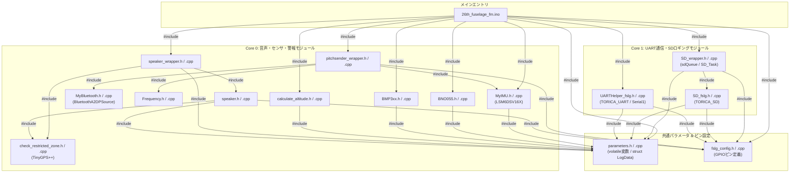

# 01_file_relationships.md - ファイル構成と依存関係・データ共有設計

**プロジェクト**: 26th_Software_Fuselage (`26th_fuselage_fm`)  
**役割**: 各ソースファイル (`.ino`, `.h`, `.cpp`) の役割、モジュール間のインクルード依存関係、および `parameters.h / .cpp` の `volatile` 変数群と `struct LogData` を用いたスレッドセーフなデータ共有設計について解説します。

---

## 1. ファイル別役割と責務一覧

本プロジェクトは機能ごとに明確にモジュール分割されており、各ヘッダーファイル (`.h`) と実装ファイル (`.cpp`) の責務は以下の通りです。

| ファイル名 | 分類 | 主な役割・責務 |
| :--- | :--- | :--- |
| **[`26th_fuselage_fm.ino`](../26th_fuselage_fm.ino)** | メインエントリ | FreeRTOS タスク初期化 (`Core0_Task`, `Core1_Task`, `SD_Task`) と起動処理 (`setup()`) を担当するメインファイル。`loop()` は空。 |
| **[`parameters.h`](../parameters.h)** / **[`parameters.cpp`](../parameters.cpp)** | グローバル変数・構造体 | センサー生データ・計算値・状態フラグを保持する `volatile` グローバル変数 (全54項目以上) と、SD記録用構造体 `struct LogData` の宣言と定義。 |
| **[`fslg_config.h`](../fslg_config.h)** / **[`fslg_config.cpp`](../fslg_config.cpp)** | ピン割り当て・定数 | ESP32 Devkit 32E 胴体桁基板における UART (`SerialRX`/`TX`)、I2C (`SDA`/`SCL`)、SPI (`SD_...`)、スピーカー (`SPK`)、インジケータ LED のピン番号設定。 |
| **[`pitchsender_wrapper.h`](../pitchsender_wrapper.h)** / **[`pitchsender_wrapper.cpp`](../pitchsender_wrapper.cpp)** | ピッチ音声フィードバックラッパー | LSM6DSV16X 6軸 IMU を用いた姿勢判定 (`TAIL_UP`, `LEVEL`, `TAIL_DOWN`) と、Bluetooth A2DP 経由のピッチ音 (`bt_set_sound`) の生成・更新ループを担当。 |
| **[`MyIMU.h`](../MyIMU.h)** / **[`MyIMU.cpp`](../MyIMU.cpp)** | 6軸 IMU ドライバ | LSM6DSV16X (I2C) の初期化 (`lsm6_init`)、FIFOからのクォータニオン・オイラー角計算 (`imu_refresh_euler`)、加速度取得 (`imu_read_accel`) を担当。 |
| **[`MyBluetooth.h`](../MyBluetooth.h)** / **[`MyBluetooth.cpp`](../MyBluetooth.cpp)** | Bluetooth A2DP オーディオ | `BluetoothA2DPSource` を用いたイヤホン (`WF-C510` 等) 接続と、割り込み・フレームコールバック (`get_data_frames`) によるエンベロープ／正弦波音声合成。 |
| **[`Frequency.h`](../Frequency.h)** / **[`Frequency.cpp`](../Frequency.cpp)** | 周波数変換 | 音階文字列 (`"C5"`, `"G5"` など) を周波数 (Hz) の浮動小数点数に変換するヘルパーモジュール。 |
| **[`BNO055.h`](../BNO055.h)** / **[`BNO055.cpp`](../BNO055.cpp)** | 9軸 IMU ドライバ | Adafruit BNO055 (I2C 0x28) の初期化・生加速度・クォータニオン・オイラー角の取得 (`read_BNO`) およびキャリブレーション値の取得 (`read_BNO_cal`)。 |
| **[`BMP3xx.h`](../BMP3xx.h)** / **[`BMP3xx.cpp`](../BMP3xx.cpp)** | 気圧センサドライバ | Adafruit BMP3XX (I2C 0x76) の初期化 (`BMP3XX_init`) と気圧・温度読み出し (`read_bmp_fslg`)。 |
| **[`calculate_altitude.h`](../calculate_altitude.h)** / **[`calculate_altitude.cpp`](../calculate_altitude.cpp)** | 高度計算ロジック | BMP390 から取得した気圧・温度に基づく標準大気式を用いた気圧高度計算 (`calculate_bmp_altitude`)。 |
| **[`check_restricted_zone.h`](../check_restricted_zone.h)** / **[`check_restricted_zone.cpp`](../check_restricted_zone.cpp)** | 進入禁止区域ジオメトリ | TinyGPSPlus を用いたポリゴン領域内外判定 (`isInsideArea`) および 境界線到達最短予想時間 TTC 計算 (`calc_time_to_reach`)。 |
| **[`speaker_wrapper.h`](../speaker_wrapper.h)** / **[`speaker_wrapper.cpp`](../speaker_wrapper.cpp)** | スピーカー警報ラッパー | `check_restricted_zone` の TTC やエリア内外情報と高度・機速を取得し、`speaker()` 関数へ渡す中間統合モジュール (`run_speaker`)。 |
| **[`speaker.h`](../speaker.h)** / **[`speaker.cpp`](../speaker.cpp)** | 警報スピーカー制御 | 飛行状態 (`current_mode`: 禁止区域／接近／通常) と速度・高度に応じた周波数／断続音を圧電スピーカー (`SPK`) に出力するドライバ (`speaker`)。 |
| **[`SD_wrapper.h`](../SD_wrapper.h)** / **[`SD_wrapper.cpp`](../SD_wrapper.cpp)** | SD キュー＆タスク管理 | `sdQueue` の作成、SD 初期化タスク設定 (`initSDTask`)、ロギングデータ投入 (`queueLogdata`)、および非同期 SD 書き込みタスク (`SD_Task`) の実装。 |
| **[`SD_fslg.h`](../SD_fslg.h)** / **[`SD_fslg.cpp`](../SD_fslg.cpp)** | SD カードドライバ | `TORICA_SD` クラスを用いた CSV ヘッダー書込 (`flashHeader`) および SRAM 節約のための 4モード分割フォーマット SD 書込処理 (`addDataToSDBuf`, `writeSD`)。 |
| **[`UARTHelper_fslg.h`](../UARTHelper_fslg.h)** / **[`UARTHelper_fslg.cpp`](../UARTHelper_fslg.cpp)** | Bico UART 通信管理 | Bico 基板 (`Serial1`: 460800 bps, 8E1) との `TORICA_UART` 送受信 (`receiveLog`, `transmitLog`) およびコマンド文字列 (`RESET`, `SPK_EN` 等) の解析処理。 |

---

## 2. インクルード依存関係グラフ

以下のグラフは、モジュール間の `#include` 依存関係を示しています（矢印は `[依存元ファイル] -->|"#include"| [インクルード先ファイル]` の関係）。



---

## 3. volatile グローバル変数と struct LogData のデータ共有設計

ESP32 はデュアルコア (Core 0 と Core 1) で構成されており、FreeRTOS タスクにより並行して異なる CPU コアでコードが実行されます。さらに、Bluetooth オーディオ (`get_data_frames`) は A2DP 割り込みスレッドで動作します。これら複数のコア・タスク間でのデータの不整合や競合を防ぎつつ、オーバーヘッドを最小限に抑えるために、本システムでは **「`volatile` グローバル変数による即時共有」** と **「`struct LogData` とキュー (`sdQueue`) によるスナップショット分離」** という二段構えのデータ受け渡しアーキテクチャを採用しています。

### 3.1 volatile グローバル変数によるスレッドセーフアクセス (`parameters.h / .cpp`)
`parameters.h` に定義されている全変数（センサー読み取り値、GPS座標、速度、高度、システム状態など）には、C/C++ 言語の **`volatile`** 修飾子が明示的に付与されています。

```cpp
// parameters.h の宣言例
extern volatile bool takeoff;
extern volatile uint32_t time_ms;
extern volatile float filtered_bmp_altitude_m;
extern volatile double data_air_gps_latitude_deg;
extern volatile float data_fslg_lsm_pitch;
// ... 他計54項目
```

#### volatile を採用する理由と設計意図
1. **コンパイラ最適化の防止とキャッシュ・レジスタ不整合の解消**:  
   Core 0 のタスク (`Core0_Task`) で計算・更新されたセンサー値 (`data_fslg_lsm_pitch` や `data_fslg_bmp_altitude_m` など) や、Core 1 で Bico UART から受信されたエアデータ (`data_air_gps_latitude_deg` など) を、別のコアやオーディオ割り込みが読んだ際に、「レジスタやキャッシュに残っている古い値」を参照するのを防ぎます。`volatile` を指定することで、毎回必ず SRAM のメモリアドレスから最新値を Read / Write させます。
2. **高速・低遅延なタスク間データ共有**:  
   32ビット以下の変数 (`float`, `uint32_t`, `bool` など) は ESP32 ではアトミック (単一サイクル) に読み書きできるため、ミューテックス (`SemaphoreHandle_t`) を毎回取得・解放するオーバーヘッドを排除でき、100Hz の高速制御タスクにおいて遅延をゼロに抑えることができます。

---

### 3.2 struct LogData と sdQueue による分離とロギングの整合性保証
`volatile` 変数は常に最新値が反映される反面、SD カードへ 54項目のデータを CSV 文字列に変換して書き込む処理 (`SD_Task`) には数十ミリ秒の時間がかかる場合があります。もし `SD_Task` が `volatile` グローバル変数を直接読みながら CSV 書込を行うと、**書込の途中で Core 0 や Core 1 のタスクがグローバル変数を更新してしまい、1行のログの中で「更新前の時間データと更新後のセンサーデータが混在する（データのティアリング／不整合）」**という問題が発生します。

これを防止するため、`parameters.h` で **値コピー専用構造体 `struct LogData`** を定義し、キューを組み合わせたスナップショット転送を行っています。

#### struct LogData の構造とメモリサイズ
```cpp
struct LogData {
    // 基本ステータス & フィルタ高度 6項目
    bool takeoff;
    uint32_t time_ms;
    float filtered_bmp_altitude_m;
    float filtered_urm_altitude_m;
    bool urm_is_reliable;
    float filtered_airspeed_ms;

    // エアデータ (Bico受信) 18項目 (double GPS含む)
    float data_air_bmp_pressure_hPa;
    // ...
    double data_air_gps_latitude_deg;
    double data_air_gps_longitude_deg;
    // ...

    // 胴体桁基板データ 24項目 (BNO055, BMP390, LSM6DSV16X)
    bool fslg_is_alive;
    float data_fslg_bno_accx_mss;
    // ...

    // 機体下電装データ 6項目
    bool under_is_alive;
    float data_under_bmp_pressure_hPa;
    // ...
}; // 総データ項目: 54項目, 実効サイズ: 約220バイト/要素
```

#### スナップショット分離の仕組みとフロー
1. **スナップショット作成 (`queueLogdata()`)**:  
   `Core1_Task` (10ms周期) の中で `queueLogdata()` を呼び出すと、その瞬間の全ての `volatile` グローバル変数をローカルな `LogData data;` 構造体インスタンスへ一括代入します。
2. **キュー送受信 (`sdQueue`)**:  
   作成されたスナップショットを FreeRTOS のメッセージキュー (`sdQueue = xQueueCreate(20, sizeof(LogData))`) へ値コピー (`xQueueSend(sdQueue, &data, 0)`) します。キューにより構造体全体（約220バイト）が複製されます。
3. **安全で非同期な SD 書込 (`SD_Task`)**:  
   Core 1 上で低優先度 (Priority 4) で動作する `SD_Task` は、キューから `LogData receivedData;` として値を取り出します (`xQueueReceive`)。これにより、どれだけ SD カードの書き込みや SPI バスがバッファで遅延しても、**そのスナップショット (ログ 1フレーム) は完全に分離・固定されており、他のコアが進行してグローバル変数を書き換えても一切影響をうけません。**

この「**リアルタイム制御用 `volatile` 共有変数**」＋「**ロギング用 `LogData` スナップショット・キュー通信**」の設計により、高いリアルタイム性・スレッドセーフティ・完全なログ整合性を同時に両立しています。

---

## 4. FreeRTOS および ハードウェア API (ペリフェラル) の抽象化設計

本システムでは、ESP32 特有のハードウェア API や FreeRTOS の OS プリミティブを各モジュールへ適切にカプセル化し、上位層が物理層を意識せずにロジックに集中できる設計となっています。

### 4.1 ハードウェア API のカプセル化
各デバイスとの物理的な通信は、専用のラッパークラスや関数で隠蔽されています。
* **`Wire` (I2C 400kHz)**: `MyIMU.cpp` (LSM6DSV16X), `BNO055.cpp`, `BMP3xx.cpp` 内部で `Wire.beginTransmission()` などの I2C ハードウェア API が呼ばれ、上位層 (`pitchsender_wrapper` など) は「初期化」と「データ取得」の関数を呼ぶだけで済みます。
* **`Serial1` (UART 460800bps)**: Bico との高速通信は `UARTHelper_fslg.cpp` 内で `Serial_Bico` として抽象化されています。`setRxBufferSize` や `flush` といった UART 特有の制御はここに閉じ込められています。
* **`SPI` (SD カード)**: `SD_fslg.cpp` 内部の `TORICA_SD` クラスが `SPI` のチップセレクト (`SD_CS`) やハードウェア SPI ピン (`SCK`, `MISO`, `MOSI`) を管理します。
* **`BluetoothA2DPSource` / `tone()`**: `MyBluetooth.cpp` では ESP32 の A2DP ハードウェアエンコーダを利用し、`speaker.cpp` では `tone()` 関数によるハードウェアタイマー PWM 出力を利用していますが、上位層からは「指定した周波数で音を鳴らす」という抽象的な関数 (`bt_set_sound`, `speaker`) しか見えません。

### 4.2 FreeRTOS タスクと同期・通信の統合
* **タスクの並行性**: `26th_fuselage_fm.ino` の `setup()` で `xTaskCreatePinnedToCore` が呼ばれ、各ペリフェラルドライバを束ねた `Core0_Task` (センサー・オーディオ) と `Core1_Task` (通信・ストレージ) が完全に分離されたコアで並列動作します。
* **正確な周期実行**: `Core0_Task` 内の `vTaskDelayUntil` を用いることで、センサーの積分計算に必要な「厳密な 10ms (100Hz) 周期」がハードウェアタイマーレベルで保証されます。
* **安全なデータ転送**: `Core1_Task` と `SD_Task` 間の通信には `xQueueSend` / `xQueueReceive` によるプロセス間通信が用いられ、SD カードの SPI 書き込みブロックがシリアル受信タスクを停止させることのない、完全に非同期なパイプラインを形成しています。
