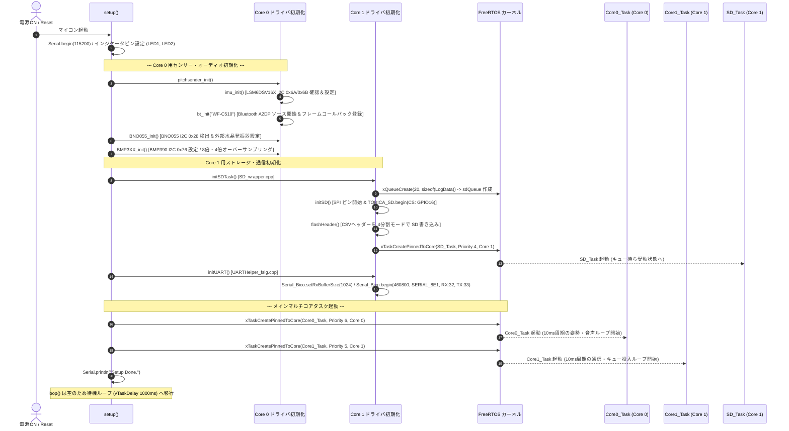
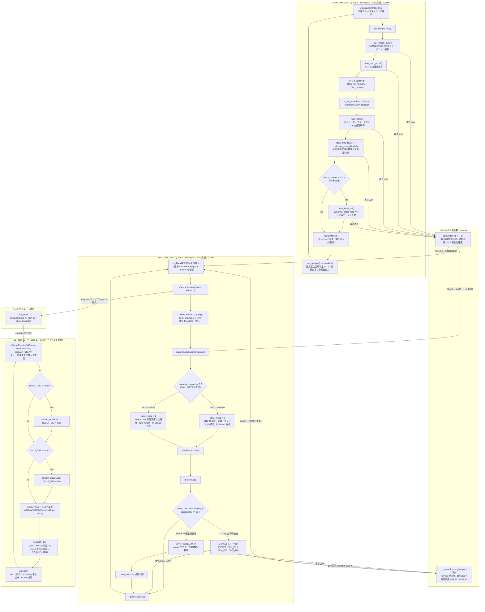

# 02_core_tasks_flowchart.md - マルチコア処理・FreeRTOSタスクとキュー制御

**プロジェクト**: 26th_Software_Fuselage (`26th_fuselage_fm`)  
**役割**: `setup()` におけるシステムの初期化シーケンスと、ESP32 デュアルコア上で稼働する 3つのメイン FreeRTOS タスク (`Core0_Task`, `Core1_Task`, `SD_Task`) および `sdQueue` の内部動作と通信フローについて解説します。

---

## 1. setup() 初期化シーケンスとタスク構成

`26th_fuselage_fm.ino` の `setup()` 関数では、ESP32 デュアルコア (Core 0 / Core 1) に応じたセンサーおよびハードウェアデバイスの初期化を実行した後、FreeRTOS の `xTaskCreatePinnedToCore()` により各コアへタスクをバインドして起動します。

### タスク割り当て仕様表
| タスク名 | バインド先 CPU コア | 優先度 (Priority) | スタックサイズ | 実行周期・トリガー | 主な担当処理 |
| :--- | :--- | :--- | :--- | :--- | :--- |
| **`Core0_Task`** | **Core 0** (`0`) | `6` (最高) | 4096 Byte | **10ms周期 (100Hz)** (`vTaskDelayUntil`) | LSM姿勢推定、BMP高度計算、BNO取得、オーディオピッチ制御、警報ブザー |
| **`Core1_Task`** | **Core 1** (`1`) | `5` (高) | 4096 Byte | **10ms周期 (100Hz)** (`vTaskDelay`) | Bico UART 受信・コマンド解析、SDキュー投入、Bico UART 時分割送信 |
| **`SD_Task`** | **Core 1** (`1`) | `4` (中) | 4096 Byte | **イベント駆動** (`xQueueReceive`) | `sdQueue` からのデータ取り出し、コマンド記録 (`RESET`/`CALIB`)、SD カード書き込み |

---

### 1.1 setup() 初期化シーケンス図 (`sequenceDiagram`)

以下は、システム起動直後から各タスクが並行稼働を開始するまでの初期化シーケンスです。

---

## 2. タスク間処理フローとキュー間通信図 (`flowchart TD`)

`Core0_Task` (Core 0) と `Core1_Task` (Core 1) は、それぞれ異なる CPU コア上で **10ms周期 (100Hz)** のメインループを維持しています。これら 2つのリアルタイム制御ループで計算・受信された全 54項目のデータが、`QueueHandle_t sdQueue` を介して非同期なストレージ書き込みタスク `SD_Task` へと受け渡される詳細な内部フローとデータ結合フローを以下に示します。

---

## 3. タスク・ループ設計の詳細解説

### 3.1 vTaskDelayUntil vs vTaskDelay の使い分けの意図
* `Core0_Task` では **`vTaskDelayUntil(&xLastWakeTime, xFrequency)`** を採用しています。これは「前回タスクが目を覚ました時刻から正確に 10ms (100Hz) 後に次回ループを開始する」制御構造であり、センサーのサンプリング周期 (積分時間) が変動すると積分誤差が蓄積する慣性航法計算（IMUのオイラー角・クォータニオン処理や高度微分計算）に必要な厳格な時間安定性を保証しています。
* `Core1_Task` では **`vTaskDelay(pdMS_TO_TICKS(10))`** を採用しています。Core 1 は UART からのバッファパース (`receiveLog`) のデータ量がパケット受信状況に応じて若干変動するため、処理終了後から一定時間 (10ms) 休眠させることで CPU 負荷を分散し、通信処理がバーストした際にも SD 書き込みタスクへ適度な実行タイムスライスを譲る設計にしています。

### 3.2 時分割送信 (`transmitLog`) の負荷分散
Core 1 から Bico 基板へセンサデータを返送する `transmitLog(transmit_counter)` は、1回で全 23項目を送ると UART TX バッファ (`460800 bps`) を占有して受信割り込みや SD キュー投入の遅延を引き起こす可能性があるため、**2フレーム時分割マルチプレクス**を行っています。
* 偶数回 (`transmit_counter == 0`): BNO055 加速度・クォータニオン・オイラー角・キャリブレーションステータスの **計14項目** (`trans_mode = 0`) を `sprintf` でフォーマットして送信。
* 奇数回 (`transmit_counter == 1`): BMP390 気圧・温度・高度および LSM6DSV16X 加速度・オイラー角の **計9項目** (`trans_mode = 1`) をフォーマットして送信。  
これにより 1フレームあたりの文字データ長を半減させ、通信帯域を平滑化しています。
