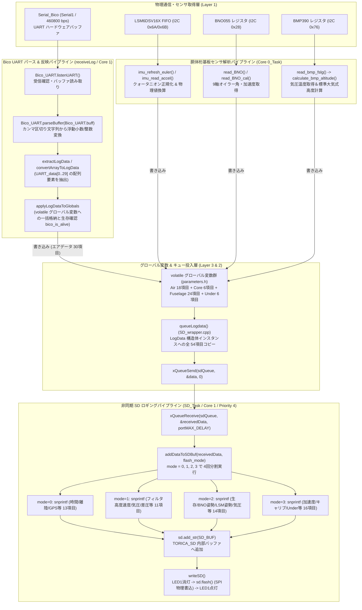

# 03_data_pipeline_flowchart.md - データ受信・解析・保存のデータパイプライン

**プロジェクト**: 26th_Software_Fuselage (`26th_fuselage_fm`)  
**役割**: Bico (エアデータ基板) から受信した生 UART バッファおよび胴体桁基板センサーから収集された生データが、パース・抽出・変換されてグローバル `volatile` 変数へ反映され、最終的に `sdQueue` を介して SD カードへ保存されるまでのエンドツーエンドなデータパイプライン関数関係図とマッピング仕様を解説します。

---

## 1. データパイプライン関数呼び出しフロー図 (`flowchart TD`)

以下は、Bico UART の物理受信からグローバル変数反映、そして 4モード分割での SD 保存までの一連の流れを描いたデータパイプライン関数呼び出しフロー図です。



---

## 2. 処理プロセスとデータ解析ロジック詳細

### 2.1 Bico からの受信・パース・グローバル反映フロー (`receiveLog()`)
`UARTHelper_fslg.cpp` 内の `receiveLog()` では、以下のように明確にモジュール化されたデータ変換パイプライン (`parseBuffer` -> `extractLogData` / `convertArrayToLogData` -> `applyLogDataToGlobals`) が走ります。

1. **バッファパース (`Bico_UART.parseBuffer`)**:  
   `Serial1` より受信したシリアルバッファ文字列 (`Bico_UART.buff`) をカンマ `,` で分割し、ASCII文字列から数値へ変換して `Bico_UART.UART_data` 浮動小数点数配列へ格納します。
2. **抽出と検証 (`readnum_bico == 30`)**:  
   正常にパースされた要素数がちょうど **30個** であることを検証 (`extractLogData`) し、パケット破損やデータ欠落を確実に排除します。正常受信時のみインジケータ `LED2` (GPIO25) を HIGH に点灯させます。
3. **構造化データ変換とグローバル適用 (`applyLogDataToGlobals`)**:  
   `UART_data[0..29]` に格納された 30個の配列データを、それぞれの型（`uint32_t`, `bool`, `uint8_t`, `double`, `float`, `int`）に応じて正しくキャスト・変換 (`convertArrayToLogData`) し、`volatile` グローバル変数群へ一括反映 (`applyLogDataToGlobals`) します。
   * **1次パケット (13項目: UART_data[0..12])**: 時間 (`time_ms`), 離陸フラグ (`takeoff`), 超音波信頼性 (`urm_is_reliable`), GPS時刻 (`hour`, `minute`, `second`, `centisecond`), GPS座標 (`latitude_deg`, `longitude_deg`, `altitude_m`), GPS速度・方位 (`groundspeed_ms`, `heading_deg`, `satellites`)。
   * **2次パケット (11項目: UART_data[13..23])**: フィルタ高度 (`filtered_bmp_altitude_m`, `filtered_urm_altitude_m`), フィルタ機速 (`filtered_airspeed_ms`), エア基板気圧温度高度 (`data_air_bmp_...`), 差圧速度 (`data_air_sdp_...`), 迎角横滑り角 (`AoA/AoS_angle_deg`), ICS舵角 (`data_ics_angle`)。
   * **3次パケット (6項目: UART_data[24..29])**: 機体下電装生存フラグ (`under_is_alive`)、機体下気圧温度高度 (`data_under_bmp_...`), 機体下超音波高度 (`data_under_urm_altitude_m`), 機体下赤外線レーザー高度 (`data_under_tsd20_altitude_m`)。
4. **生存死活監視 (`bico_is_alive`)**:  
   最終受信時間 (`last_bico_time_ms`) から 1000ms (1秒) 以上経過した場合は自動的に `bico_is_alive = false;` とみなし、システムの安全性を担保します。

---

## 3. SD 記録用 54項目データインデックスマッピング表 (`flash_mode: 0〜3`)

SD カードに記録される CSV ログは、合計 **54項目** という膨大な情報量を含みます。一度の `snprintf()` で 54項目全てを文字列化しようとすると、バッファ (`SD_BUF[2048]`) が長大化してスタックオーバーフローや処理時間遅延を引き起こす可能性があるため、`addDataToSDBuf(const LogData& data, int flash_mode)` では **4モード (`flash_mode`: 0〜3) に分割して短尺 CSV チャンクを連続生成・追記する設計** となっています。

### 3.1 モード別マッピング表

| モード (`flash_mode`) | 項目数 | 書式・項目名 (`struct LogData data` より出力) | データの分類・意味 |
| :---: | :---: | :--- | :--- |
| **Mode 0** | **13項目** | 1. `time_ms` (`%lu`)<br>2. `takeoff` (`%d`)<br>3. `urm_is_reliable` (`%d`)<br>4. `data_air_gps_hour` (`%u`)<br>5. `data_air_gps_minute` (`%u`)<br>6. `data_air_gps_second` (`%u`)<br>7. `data_air_gps_centisecond` (`%u`)<br>8. `data_air_gps_latitude_deg` (`%.7f`)<br>9. `data_air_gps_longitude_deg` (`%.7f`)<br>10. `data_air_gps_altitude_m` (`%.2f`)<br>11. `data_air_gps_groundspeed_ms` (`%.2f`)<br>12. `data_air_gps_heading_deg` (`%.1f`)<br>13. `data_air_gps_satellites` (`%u`) | **機体運行基本 & GPS時刻・座標・速度情報**<br>(エアデータ基板より受信) |
| **Mode 1** | **11項目** | 14. `filtered_bmp_altitude_m` (`%.2f`)<br>15. `filtered_urm_altitude_m` (`%.2f`)<br>16. `filtered_airspeed_ms` (`%.2f`)<br>17. `data_air_bmp_pressure_hPa` (`%.2f`)<br>18. `data_air_bmp_temperature_deg` (`%.2f`)<br>19. `data_air_bmp_altitude_m` (`%.2f`)<br>20. `data_air_sdp_differentialPressure_Pa` (`%.2f`)<br>21. `data_air_sdp_airspeed_ms` (`%.2f`)<br>22. `data_air_AoA_angle_deg` (`%.2f`)<br>23. `data_air_AoS_angle_deg` (`%.2f`)<br>24. `data_ics_angle` (`%d`) | **フィルタリング高度・対気速度・エア基板センサ・操舵角**<br>(エアデータ基板より受信) |
| **Mode 2** | **14項目** | 25. `fslg_is_alive` (`%d`)<br>26. `data_fslg_bno_qw` (`%.2f`)<br>27. `data_fslg_bno_qx` (`%.2f`)<br>28. `data_fslg_bno_qy` (`%.2f`)<br>29. `data_fslg_bno_qz` (`%.2f`)<br>30. `data_fslg_bno_roll` (`%.2f`)<br>31. `data_fslg_bno_pitch` (`%.2f`)<br>32. `data_fslg_bno_yaw` (`%.2f`)<br>33. `data_fslg_lsm_roll` (`%.2f`)<br>34. `data_fslg_lsm_pitch` (`%.2f`)<br>35. `data_fslg_lsm_yaw` (`%.2f`)<br>36. `data_fslg_bmp_pressure_hPa` (`%.2f`)<br>37. `data_fslg_bmp_temperature_deg` (`%.2f`)<br>38. `data_fslg_bmp_altitude_m` (`%.2f`) | **胴体桁基板姿勢クォータニオン・オイラー角・気圧高度**<br>(自基板 BNO055 / LSM6DSV16X / BMP390 より取得) |
| **Mode 3** | **16項目** | 39. `data_fslg_bno_accx_mss` (`%.2f`)<br>40. `data_fslg_bno_accy_mss` (`%.2f`)<br>41. `data_fslg_bno_accz_mss` (`%.2f`)<br>42. `data_fslg_lsm_accx_mss` (`%.2f`)<br>43. `data_fslg_lsm_accy_mss` (`%.2f`)<br>44. `data_fslg_lsm_accz_mss` (`%.2f`)<br>45. `data_fslg_bno_cal_system` (`%u`)<br>46. `data_fslg_bno_cal_gyro` (`%u`)<br>47. `data_fslg_bno_cal_accel` (`%u`)<br>48. `data_fslg_bno_cal_mag` (`%u`)<br>49. `under_is_alive` (`%d`)<br>50. `data_under_bmp_pressure_hPa` (`%.2f`)<br>51. `data_under_bmp_temperature_deg` (`%.2f`)<br>52. `data_under_bmp_altitude_m` (`%.2f`)<br>53. `data_under_urm_altitude_m` (`%.2f`)<br>54. `data_under_tsd20_altitude_m` (`%.2f\n`) | **胴体桁加速度・BNOキャリブ＆機体下電装データ**<br>(自基板 IMU 加速度 ＋ 機体下基板データ) *(※末尾に改行 `\n` を付与し 1レコード完了)* |

---

## 4. flashHeader() におけるヘッダー書き込みの工夫と最適化

`SD_fslg.cpp` に実装されている `flashHeader()` は、起動時 (`setup()` -> `initSDTask()`) に 1回だけ実行され、CSV ファイルの1行目となる 54項目のカラム名ヘッダー文字列を SD カードへ書き込みます。

```cpp
void flashHeader() {
  if (SD_is_active) {
    const char *str[3];
    for (int i = 0; i < 4; i++) {
      switch (i) {
        case 0: // 13項目 (time_ms ~ data_air_gps_satellites)
          str[0] = "time_ms,takeoff,urm_is_reliable,data_air_gps_hour,";
          str[1] = "data_air_gps_minute,data_air_gps_second,data_air_gps_centisecond,data_air_gps_latitude_deg,";
          str[2] = "data_air_gps_longitude_deg,data_air_gps_altitude_m,data_air_gps_groundspeed_ms,data_air_gps_heading_deg,data_air_gps_satellites,";
          break;
        case 1: // 11項目 (filtered_bmp_altitude_m ~ data_ics_angle)
          // ...
        case 2: // 14項目 (fslg_is_alive ~ data_fslg_bmp_altitude_m)
          // ...
        case 3: // 16項目 (data_fslg_bno_accx_mss ~ data_under_tsd20_altitude_m\n)
          // ...
      }
      sprintf(SD_BUF, "%s%s%s", str[0], str[1], str[2]);
      sd.add_str(SD_BUF);
      sd.flash();
      delayMicroseconds(10); // 時間遅延とSRAM負荷軽減
    }
  }
}
```

### この設計がもたらす 3つの強力な利点
1. **SRAM バッファメモリの消費量抑制**:  
   54個のカラム名をすべて連結すると 1,000文字近い文字列となります。一度に巨大なスタック／静的文字列を扱う代わりに、**`str[0]` 〜 `str[2]` のポインタ配列で 3分割し、さらにループ `i=0..3` で 4回のモードチャンクに分けて処理**することで、SRAM バッファ (`SD_BUF[2048]`) を確実にセーフティ領域内に保ちます。
2. **SPI フラッシュ書込のバースト負荷分散**:  
   チャンクごとに即座に `sd.add_str(SD_BUF); sd.flash();` を実行して SD カードへ書き出すため、一度に大量のセクタ書き込みが発生して SPI バスがストールするのを防いでいます。
3. **微小ウェイト (`delayMicroseconds(10)`) によるハードウェア安定化**:  
   各フラッシュコマンドの間に **`delayMicroseconds(10)`** の遅延を入れることで、microSD カード内部のコントローラがセクタバッファの書き込み準備・回復を行うための物理的なマージン時間を確保し、書込エラーや初期化失敗率を劇的に低減させています。
