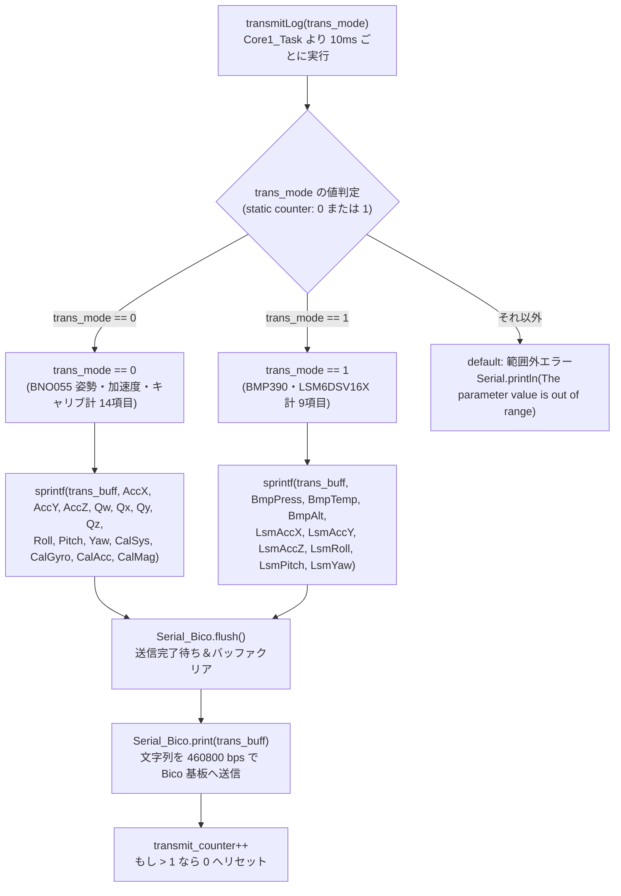
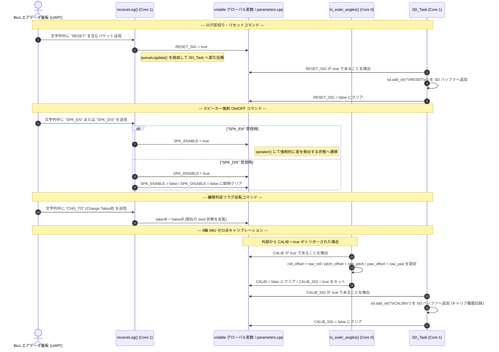
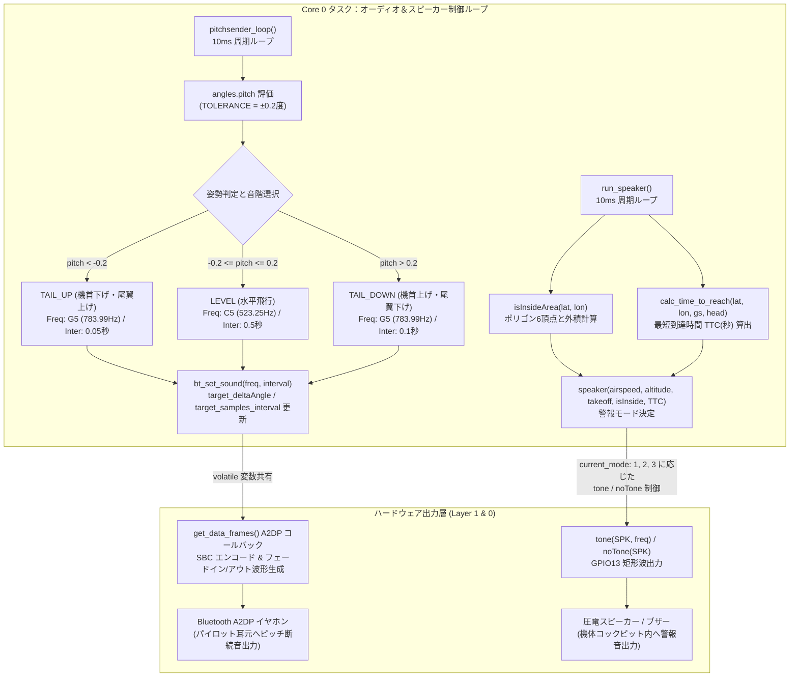

# 04_web_command_flowchart.md - 時分割配信・コマンド制御・フィードバック警報詳細

**プロジェクト**: 26th_Software_Fuselage (`26th_fuselage_fm`)  
**役割**: 胴体桁基板 (`ESP32 Devkit 32E`) における Bico 基板との時分割マルチプレクス送信 (`transmitLog`)、受信コマンド (`RESET`/`SPK_EN`/`CALIB`等) の制御シーケンス、およびパイロット向け Bluetooth A2DP ピッチ音声フィードバックと進入禁止区域 TTC 警告ブザー (`run_speaker`) の詳細メカニズムについて解説します。

*(※注: 本ドキュメントは `requirements.md` の第5項 `04_web_command_flowchart.md` に対応するドキュメントです。本プロジェクト `26th_fuselage_fm.ino` では Wi-Fi AP や電流電圧計 (`power_checker.cpp`) の代わりに、Bico との高頻度シリアルマルチプレクス通信、及びパイロット向け Bluetooth ワイヤレス音声フィードバック・圧電スピーカーによる空間警報制御を担うため、それらの詳細仕様書として構成します。)*

---

## 1. 時分割マルチプレクス送信制御 (`transmitLog`) のフローチャート (`flowchart TD`)

胴体桁基板は独自に取得している 23項目の高精度センサーデータ（BNO055 姿勢・加速度、LSM6DSV16X 姿勢・加速度、BMP390 高度）を `Serial1` (`460800 bps, 8E1`) で Bico 基板へと返信し、テレメトリーに合流させます。全ての文字列を一度に送ると送信バッファやタスク時間を圧迫するため、`Core1_Task` から 10ms 周期で呼ばれる `transmitLog(transmit_counter)` で **2ステップ時分割マルチプレクス送信** を行います。

---

## 2. コマンド制御・キャリブレーション処理のシーケンス図 (`sequenceDiagram`)

Bico 基板は、Web コンソールまたは操縦席スイッチ等から送信されたコマンドを UART データバッファ (`Bico_UART.buff`) の中に文字列コマンド (`RESET`, `SPK_EN`, `SPK_DIS`, `CHG_TO`) として混入させて胴体桁基板へ中継します。また、キャリブレーション信号 (`CALIB`) はグローバル変数経由で姿勢計算に介在します。これらを受信・検出した際の状態遷移と `SD_Task` との同期処理を以下に示します。

---

## 3. Bluetooth A2DP 音声フィードバック & 進入禁止区域 TTC 警報ロジック

本システムにおけるパイロットインターフェースは、「**姿勢を音階で伝える Bluetooth A2DP ワイヤレスイヤホン (`WF-C510`)**」と、「**進入禁止区域との距離感をトーンで警告する車載圧電スピーカー (`SPK`: GPIO13)**」という 2つの独立したフィードバック系で構築されています。

### 3.1 構成図・ピン接続と制御フロー (`flowchart TD`)

---

### 3.2 進入禁止区域判定 (`isInsideArea`) と最短到達時間 (`calc_time_to_reach`) の計算式解説

#### 1. エリア内外判定 (`isInsideArea`): 境界ベクトルと外積 Z による判定
反時計回りに定義されたポリゴン頂点配列 $B_0, B_1, \dots, B_{N-1}$（にいじゅく未来公園内 6頂点）に対し、各境界線ベクトル $\vec{B_{k-1} B_k}$ と機体位置ベクトル $\vec{B_{k-1} P}$ の 2次元外積 $Z$ を計算します。

$$Z = (B_k.\text{lon} - B_{k-1}.\text{lon}) \times (P.\text{lat} - B_{k-1}.\text{lat}) - (B_k.\text{lat} - B_{k-1}.\text{lat}) \times (P.\text{lon} - B_{k-1}.\text{lon})$$

* 判定基準: 全ての境界線 $k$ において $Z \ge 0$ の場合のみ **「飛行可能区域内 (`true`)」** と判定。1つでも $Z < 0$（境界線の右側）があれば **「禁止区域内 (`false`)」** とみなします。

#### 2. 最短到達時間計算 (`calc_time_to_reach`): 接近速度と距離の三角関数モデル
機体が対地速度 $v$、進行方位 $\alpha$ で飛行しているとき、方位角 $\theta_k$ の境界線ベクトルに向かう接近速度 $v_{\text{app}}$ と到達秒数 $t$ を求めます。

1. **接近速度 $v_{\text{app}}$**:  
   $$v_{\text{app}} = v \cdot \sin(\alpha - \theta_k)$$
   （※ $v_{\text{app}} \le 0.05\,\text{m/s}$ の場合は平行・遠ざかっているため除外）
2. **境界直線への垂直距離 $D_{\text{min}}$**:  
   終点 $B_k$ から機体 $P$ までの直線距離を $L_{B_k P}$、$\angle B_{k-1} B_k P = \phi_k$ としたとき、垂直最短距離は次式で計算されます。
   $$D_{\text{min}} = L_{B_k P} \cdot |\sin \phi_k|$$
3. **到達時間 $t$**:  
   $$t = \frac{D_{\text{min}}}{v_{\text{app}}}$$
   全境界線の中での最小値 $\min(t)$ を **TTC (Time To Contact)** として返します。

---

### 3.3 スピーカー警報 4段階モード決定表 (`speaker.cpp`)

| モード (`current_mode`) | 状態名称 | 判定条件 | ブザー周波数 (`sound_freq`) | 断続インターバル (`interval`) | 備考 |
| :---: | :--- | :--- | :--- | :--- | :--- |
| **`0`** | **停止 (Platform)** | `takeoff == false && SPK_ENABLE == false` | 無音 (`noTone`) | 停止 | 離陸前や地上待機中は音を鳴らさない |
| **`1`** | **禁止区域内 (Inside Alert)** | `takeoff == true` 且つ `isInsideArea == false` | **`440 Hz` (A4)** | **連続発音 (ピーーー)** | 最優先の緊急警報。即座に退避が必要 |
| **`2`** | **危険接近 (Approaching Alert)** | `takeoff == true` 且つ `0.0 < TTC < 6.0秒` | **`880 Hz` (A5)** | **連続発音 (ピーーー)** | 6秒以内に境界線へ到達する危険な接近状態 |
| **`3`** | **通常飛行 (Normal Flight)** | 区域内 (`isInsideArea == true`) 且つ安全 (`TTC >= 6.0` または遠ざかり) | 対気速度による3段階: ・`< 9.5 m/s`: **`440 Hz`** ・`9.5〜10.8 m/s`: **`880 Hz`** ・`>= 10.8 m/s`: **`1320 Hz`** | 高度による変化: ・`< 0.0m`: `100ms` ・`0.0〜1.5m`: `700〜125ms` 可変 ・`>= 1.5m`: `900ms` | 機速・高度・上昇下降ペテンを音の高さと間隔でパイロットにフィードバックする通常動作 |
