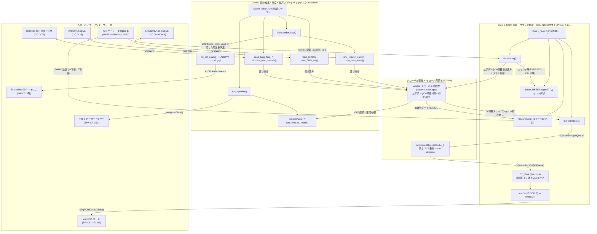
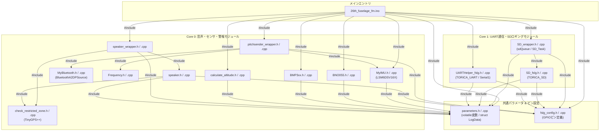
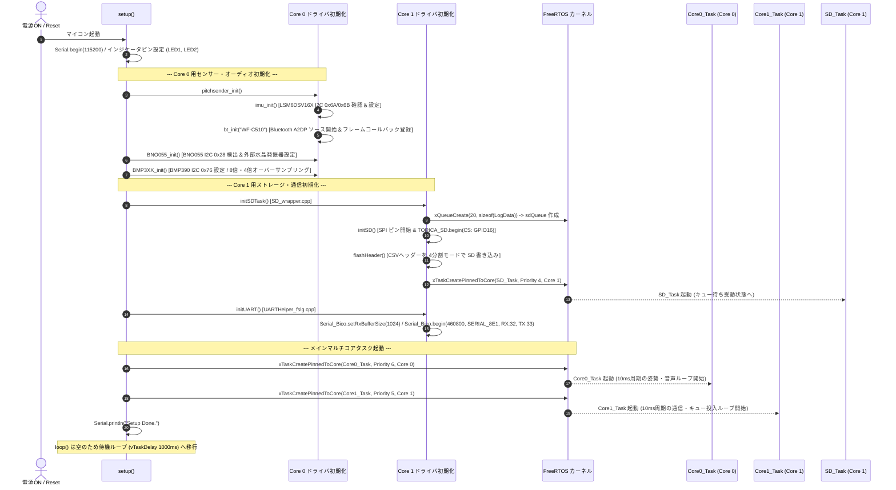
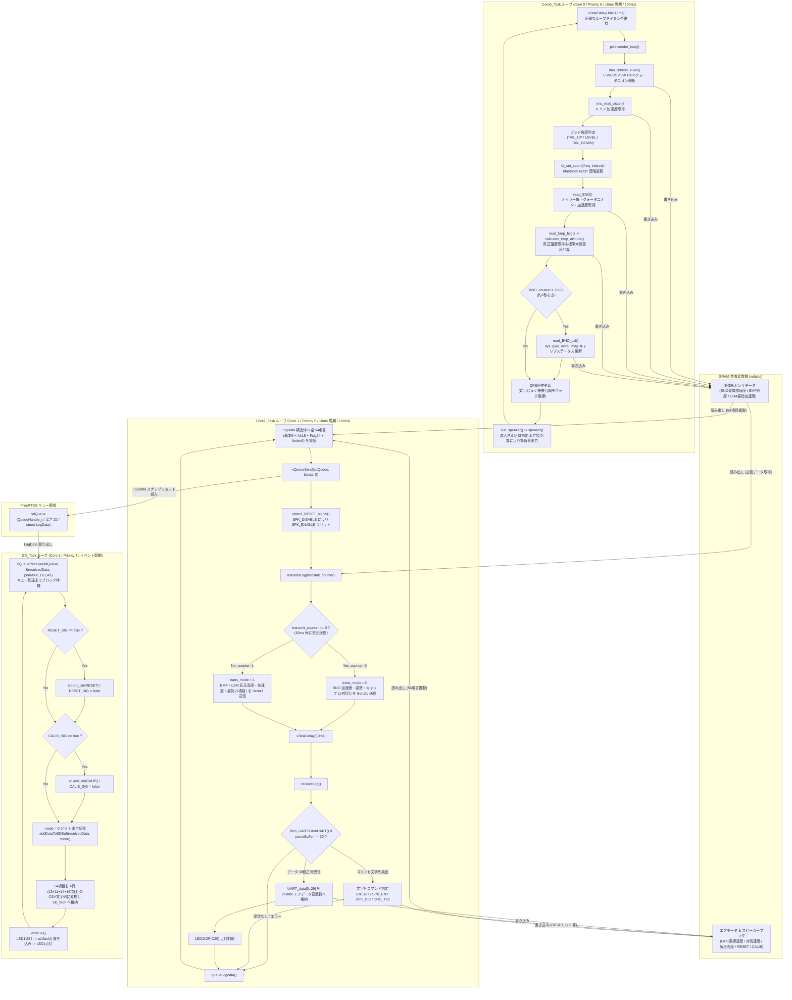
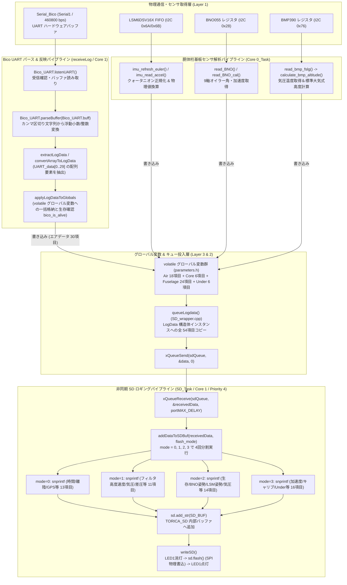
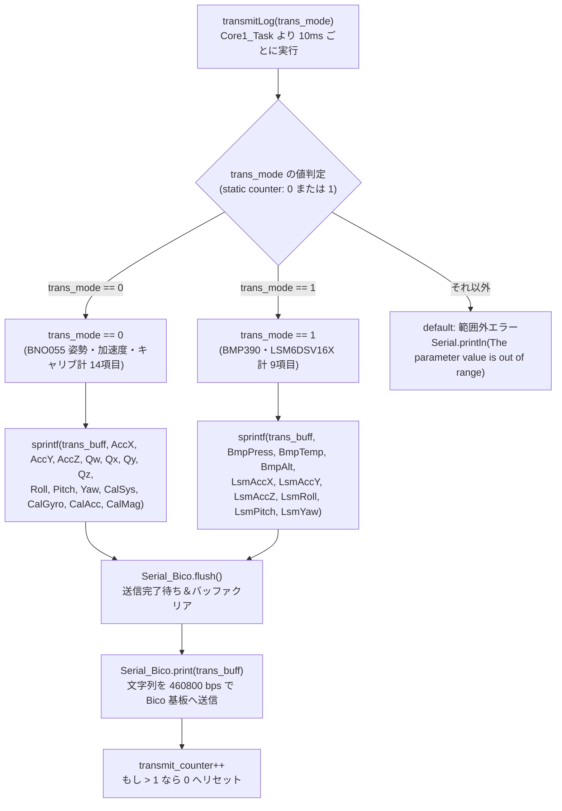
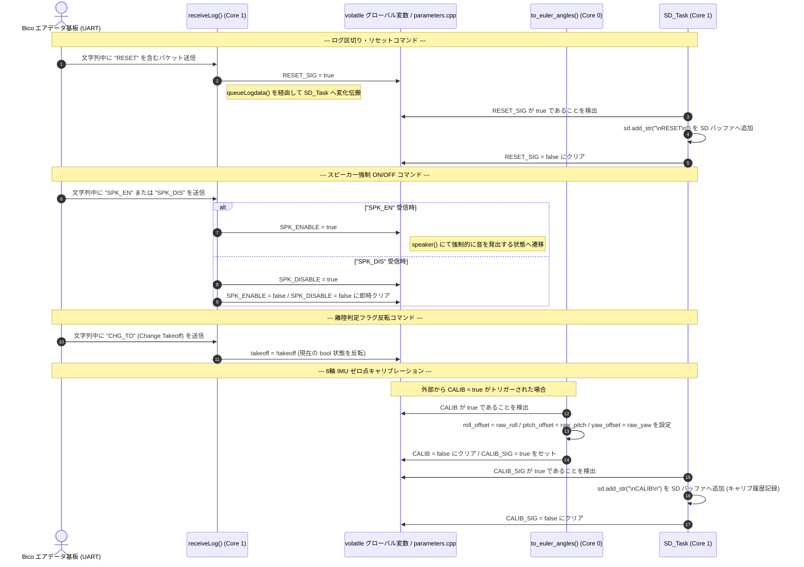
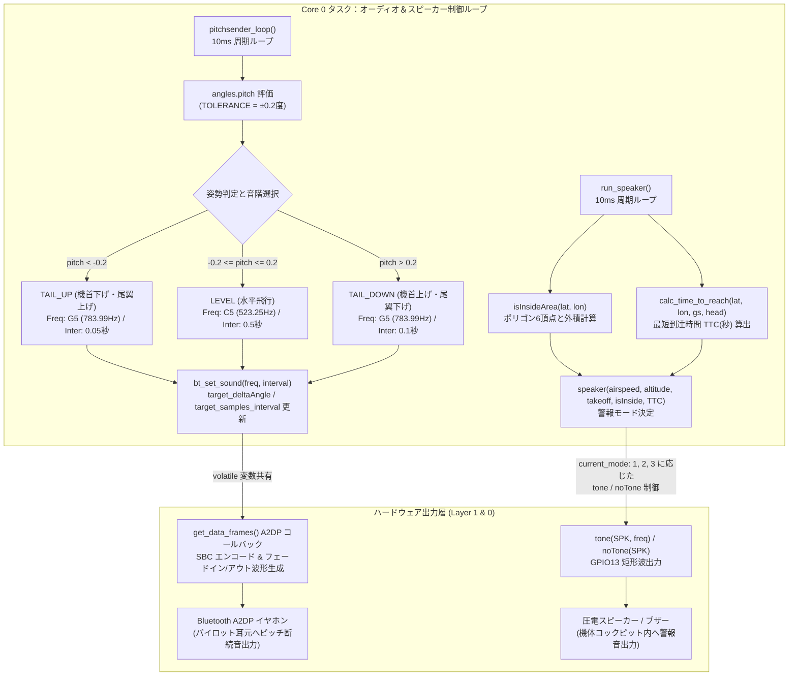

# 05_drawio_mermaid_snippets.md - draw.io 貼り付け専用 Mermaid コード集

**プロジェクト**: 26th_Software_Fuselage (`26th_fuselage_fm`)  
**用途**: 本ドキュメントは、説明テキストやテーブルを排除し、draw.io (`app.diagrams.net`) の「挿入 > 高度な設定 > Mermaid...」からコピー＆ペーストしてそのまま図解を生成できるよう、厳格な draw.io 互換ルール（エッジラベルのカッコのダブルクォート囲み、標準ボックス `["..."]` 統一、特殊文字のクォート等）に準拠した純粋な Mermaid コードのみを収録しています。

---

## 1. システム全体アーキテクチャ図 (`doc/README.md`)

---

## 2. インクルード依存関係グラフ (`doc/01_file_relationships.md`)

---

## 3. 初期化シーケンス図 (`doc/02_core_tasks_flowchart.md`)

---

## 4. タスク間処理フローとキュー間通信図 (`doc/02_core_tasks_flowchart.md`)

---

## 5. データパイプライン関数呼び出しフロー図 (`doc/03_data_pipeline_flowchart.md`)

---

## 6. 時分割マルチプレクス送信フローチャート (`doc/04_web_command_flowchart.md`)

---

## 7. コマンド制御・キャリブレーション処理シーケンス図 (`doc/04_web_command_flowchart.md`)

---

## 8. Bluetooth A2DP 音声＆進入禁止区域警報フローチャート (`doc/04_web_command_flowchart.md`)

---

## 9. 4層レイヤー構造・関数ヒエラルキー図 (`doc/06_layer_hierarchy_flowchart.md`)

```mermaid
flowchart TD
    %% =========================================================================
    %% Layer 3: 抽象データロジック＆アプリケーション計算層 (最も高い抽象度)
    %% =========================================================================
    subgraph Layer3 ["Layer 3: 抽象データロジック＆アプリケーション計算層"]
        L3_LogBuild["queueLogdata()<br>(スナップショット構築)"]
        L3_SDBuf["addDataToSDBuf()<br>(54項目 4分割 CSV 生成)"]
        L3_Euler["to_euler_angles() & normalize()<br>(クォータニオン正規化・オイラー角計算)"]
        L3_AltCalc["calculate_bmp_altitude()<br>(標準大気気圧高度計算)"]
        L3_FreqGet["frequency_get()<br>(音階文字列 -> 周波数換算)"]
        L3_Zone["isInsideArea() & calc_time_to_reach()<br>(ポリゴン外積内外判定 & TTC 最短到達秒数計算)"]
    end

    %% =========================================================================
    %% Layer 2: 中間ラッパー＆タスク・キュー制御層
    %% =========================================================================
    subgraph Layer2 ["Layer 2: 中間ラッパー＆タスク・キュー制御層"]
        L2_C0["Core0_Task()<br>(Core 0 メインループ 100Hz)"]
        L2_C1["Core1_Task()<br>(Core 1 メインループ 100Hz)"]
        L2_SD["SD_Task()<br>(Core 1 ロギングループ Priority 4)"]
        
        L2_PitchLoop["pitchsender_loop()<br>(姿勢＆音程フィードバックループ)"]
        L2_PitchInit["pitchsender_init()<br>(IMU＆BT 初期化ラッパー)"]
        L2_SpkRun["run_speaker()<br>(エリア警報統括ラッパー)"]
        L2_InitSDTask["initSDTask()<br>(キュー生成＆SDタスク起動ラッパー)"]
        
        L2_RecvLog["receiveLog()<br>(Bico UART 受信・コマンド解析ラッパー)"]
        L2_TransLog["transmitLog()<br>(Bico UART 2モード時分割送信ラッパー)"]
        L2_DetectRst["detect_RESET_signal()<br>(スピーカー制御リセット)"]
    end

    %% =========================================================================
    %% Layer 1: ハードウェアドライバ＆I/Oプロトコル層
    %% =========================================================================
    subgraph Layer1 ["Layer 1: ハードウェアドライバ＆I/Oプロトコル層"]
        L1_LSM["imu_init() / imu_refresh_euler() / imu_read_accel()<br>(LSM6DSV16X I2C ドライバ & FIFO読み取り)"]
        L1_Reg["writeReg() / readRegs()<br>(I2C レジスタ読み書きドライバ)"]
        L1_BNO["BNO055_init() / read_BNO() / read_BNO_cal()<br>(Adafruit BNO055 9軸センサドライバ)"]
        L1_BMP["BMP3XX_init() / read_bmp_fslg()<br>(Adafruit BMP3XX 気圧センサドライバ)"]
        L1_BT["bt_init() / bt_set_sound() / get_data_frames()<br>(Bluetooth A2DP ドライバ & エンベロープ合成)"]
        L1_SPK["speaker_init() / speaker()<br>(圧電スピーカー PWM ドライバ)"]
        L1_SD["initSD() / flashHeader() / writeSD()<br>(TORICA_SD クラス SPI ストレージドライバ)"]
        L1_UART["initUART() / Bico_UART.listenUART() / parseBuffer()<br>(TORICA_UART コア通信ドライバ)"]
    end

    %% =========================================================================
    %% Layer 0: 物理ハードウェア・ピン＆RTOSカーネル層 (最も低い抽象度)
    %% =========================================================================
    subgraph Layer0 ["Layer 0: 物理ハードウェア・ピン＆RTOSカーネル層"]
        L0_Pins["物理 GPIO ピン配置<br>UART: 32/33 | I2C: 21/22 | SPI: 16/18/19/23 | SPK: 13 | LED: 3/4/25"]
        L0_Periph["シリアル・無線ペリフェラル<br>Serial1 (UART) | Wire (I2C) | SPI | BluetoothA2DPSource"]
        L0_RTOS["FreeRTOS カーネル・OS プリミティブ<br>xTaskCreatePinnedToCore / xQueueCreate / xQueueSend / xQueueReceive"]
    end

    %% =================== 垂直呼び出し関係 (Layer 2 -> Layer 3) ===================
    L2_C1 -->|"呼び出し"| L3_LogBuild
    L2_SD -->|"呼び出し"| L3_SDBuf
    L2_C0 -->|"呼び出し"| L3_AltCalc
    L2_PitchLoop -->|"呼び出し"| L3_FreqGet
    L2_SpkRun -->|"呼び出し"| L3_Zone

    %% =================== 垂直呼び出し関係 (Layer 2 -> Layer 1) ===================
    L2_PitchInit -->|"呼び出し"| L1_LSM
    L2_PitchInit -->|"呼び出し"| L1_BT
    L2_PitchLoop -->|"呼び出し"| L1_LSM
    L2_PitchLoop -->|"呼び出し"| L1_BT
    L1_LSM -->|"内部呼び出し"| L3_Euler
    L1_LSM -->|"内部呼び出し"| L1_Reg
    
    L2_C0 -->|"呼び出し"| L1_BNO
    L2_C0 -->|"呼び出し"| L1_BMP
    L2_C0 -->|"呼び出し"| L2_PitchLoop
    L2_C0 -->|"呼び出し"| L2_SpkRun
    L2_SpkRun -->|"呼び出し"| L1_SPK

    L2_InitSDTask -->|"呼び出し"| L1_SD
    L2_RecvLog -->|"呼び出し"| L1_UART
    L2_TransLog -->|"呼び出し"| L0_Periph
    L2_C1 -->|"呼び出し"| L2_RecvLog
    L2_C1 -->|"呼び出し"| L2_TransLog
    L2_C1 -->|"呼び出し"| L2_DetectRst
    L2_SD -->|"呼び出し"| L1_SD

    %% =================== 垂直呼び出し関係 (Layer 1 -> Layer 0) ===================
    L1_Reg -->|"I2C 物理通信"| L0_Periph
    L1_BNO -->|"I2C 物理通信"| L0_Periph
    L1_BMP -->|"I2C 物理通信"| L0_Periph
    L1_BT -->|"A2DP オーディオ出力"| L0_Periph
    L1_SPK -->|"tone / noTone 矩形波出力"| L0_Pins
    L1_SD -->|"SPI フラッシュ書き出し"| L0_Pins
    L1_UART -->|"Serial1 物理受信"| L0_Pins

    %% =================== RTOS とタスク・キュー結合 (Layer 0 -> Layer 2/3) ===================
    L0_RTOS -->|"タスク生成＆スケジューリング"| L2_C0
    L0_RTOS -->|"タスク生成＆スケジューリング"| L2_C1
    L0_RTOS -->|"タスク生成＆スケジューリング"| L2_SD
    L2_InitSDTask -->|"xQueueCreate()"| L0_RTOS
    L3_LogBuild -->|"xQueueSend(sdQueue)"| L0_RTOS
    L2_SD -->|"xQueueReceive(sdQueue)"| L0_RTOS
```

