# 06_layer_hierarchy_flowchart.md - 4層レイヤー構造・関数ヒエラルキー設計書

**プロジェクト**: 26th_Software_Fuselage (`26th_fuselage_fm`)  
**役割**: 本プロジェクトを構成する全関数・データ構造・物理インターフェースを、抽象度に応じた **4層のレイヤー (Layer 3 〜 Layer 0)** に分類し、関数呼び出しやデータアクセスのヒエラルキーと垂直関係を可視化したアーキテクチャ設計書です。

---

## 1. 4層レイヤーの定義と責務

本ソフトウェアは、物理層や OS 依存の低レイヤーからアプリケーション固有のドメインロジックを高レイヤーへと完全に分離した **4層レイヤー構造** を採用しています。上層から下層へと呼び出しを行い、下層は物理 I/O や割り込みの処理結果を上層のデータコンテナへフィードバックします。

| レイヤー | 名称 | 責務と特徴 | 本プロジェクトに属する主なモジュール・関数 |
| :---: | :--- | :--- | :--- |
| **Layer 3** | **抽象データロジック＆アプリケーション計算層** *(高レイヤー)* | ハードウェアや通信プロトコルから完全に独立した純粋なデータ変換、物理公式による高度・到達時間計算、空間内外判定、データバッファ構築を担当。 | `to_euler_angles()`, `normalize()`, `calculate_bmp_altitude()`, `isInsideArea()`, `calc_time_to_reach()`, `frequency_get()`, `queueLogdata()`, `addDataToSDBuf()` |
| **Layer 2** | **中間ラッパー＆タスク・キュー制御層** | FreeRTOS タスクのスケジューリング (`Core0_Task`, `Core1_Task`, `SD_Task`)、サブシステム統合ラッパー (`pitchsender_loop`, `run_speaker`)、キュー間転送制御および通信状態管理。 | `Core0_Task()`, `Core1_Task()`, `SD_Task()`, `pitchsender_init()`, `pitchsender_loop()`, `run_speaker()`, `initSDTask()`, `receiveLog()`, `transmitLog()`, `detect_RESET_signal()` |
| **Layer 1** | **ハードウェアドライバ＆I/Oプロトコル層** | センサーや通信チップとのシリアルプロトコル (I2C, SPI, UART, A2DP) 通信、レジスタ読み書き、音響合成や SD セクタバッファの物理操作を担当するドライバ群。 | `imu_init()`, `imu_refresh_euler()`, `imu_read_accel()`, `BNO055_init()`, `read_BNO()`, `read_BNO_cal()`, `BMP3XX_init()`, `read_bmp_fslg()`, `bt_init()`, `bt_set_sound()`, `get_data_frames()`, `speaker_init()`, `speaker()`, `initSD()`, `flashHeader()`, `writeSD()`, `initUART()`, `writeReg()`, `readRegs()` |
| **Layer 0** | **物理ハードウェア・ピン＆RTOSカーネル層** *(低レイヤー)* | ESP32 Devkit 32E の物理ピン・回路接続、マイコン内蔵シリアルペリフェラル (`Serial1`, `Wire`, `SPI`)、および FreeRTOS カーネルのマルチコア OS プリミティブ。 | **ピン**: `SerialTX(33)`, `SerialRX(32)`, `I2C_SDA(21)`, `I2C_SCL(22)`, `SD_CS(16)`, `SD_SCK(18)`, `SD_MOSI(23)`, `SD_MISO(19)`, `SPK(13)`, `LED1(3/4)`, `LED2(25)` **ペリフェラル**: `Serial1`, `Wire`, `SPI`, `BluetoothA2DPSource` **RTOS**: `xTaskCreatePinnedToCore`, `xQueueCreate`, `xQueueSend`, `xQueueReceive`, `vTaskDelayUntil`, `vTaskDelay` |

---

## 2. 4層レイヤー構造・関数ヒエラルキーと処理関係図 (`flowchart TD`)

以下は、全関数と物理リソースがどのレイヤーに位置するかを示し、レイヤー間の関数呼び出し (`-->`) とデータアクセス・キュー転送の流れを可視化したヒエラルキー図です。上段 (Layer 3) が最も高い抽象度を持ち、下段 (Layer 0) が最も低い物理・OS プリミティブ層になります。

```mermaid
flowchart TD
    %% =========================================================================
    %% Layer 3: 抽象データロジック＆アプリケーション計算層 (最も高い抽象度)
    %% =========================================================================
    subgraph Layer3 ["Layer 3: 抽象データロジック＆アプリケーション計算層"]
        L3_LogBuild["queueLogdata()<br>(スナップショット構築)"]
        L3_SDBuf["addDataToSDBuf()<br>(54項目 4分割 CSV 生成)"]
        L3_Euler["to_euler_angles() & normalize()<br>(クォータニオン正規化・オイラー角計算)"]
        L3_AltCalc["calculate_bmp_altitude()<br>(標準大気気圧高度計算)"]
        L3_FreqGet["frequency_get()<br>(音階文字列 -> 周波数換算)"]
        L3_Zone["isInsideArea() & calc_time_to_reach()<br>(ポリゴン外積内外判定 & TTC 最短到達秒数計算)"]
    end

    %% =========================================================================
    %% Layer 2: 中間ラッパー＆タスク・キュー制御層
    %% =========================================================================
    subgraph Layer2 ["Layer 2: 中間ラッパー＆タスク・キュー制御層"]
        L2_C0["Core0_Task()<br>(Core 0 メインループ 100Hz)"]
        L2_C1["Core1_Task()<br>(Core 1 メインループ 100Hz)"]
        L2_SD["SD_Task()<br>(Core 1 ロギングループ Priority 4)"]
        
        L2_PitchLoop["pitchsender_loop()<br>(姿勢＆音程フィードバックループ)"]
        L2_PitchInit["pitchsender_init()<br>(IMU＆BT 初期化ラッパー)"]
        L2_SpkRun["run_speaker()<br>(エリア警報統括ラッパー)"]
        L2_InitSDTask["initSDTask()<br>(キュー生成＆SDタスク起動ラッパー)"]
        
        L2_RecvLog["receiveLog()<br>(Bico UART 受信・コマンド解析ラッパー)"]
        L2_TransLog["transmitLog()<br>(Bico UART 2モード時分割送信ラッパー)"]
        L2_DetectRst["detect_RESET_signal()<br>(スピーカー制御リセット)"]
    end

    %% =========================================================================
    %% Layer 1: ハードウェアドライバ＆I/Oプロトコル層
    %% =========================================================================
    subgraph Layer1 ["Layer 1: ハードウェアドライバ＆I/Oプロトコル層"]
        L1_LSM["imu_init() / imu_refresh_euler() / imu_read_accel()<br>(LSM6DSV16X I2C ドライバ & FIFO読み取り)"]
        L1_Reg["writeReg() / readRegs()<br>(I2C レジスタ読み書きドライバ)"]
        L1_BNO["BNO055_init() / read_BNO() / read_BNO_cal()<br>(Adafruit BNO055 9軸センサドライバ)"]
        L1_BMP["BMP3XX_init() / read_bmp_fslg()<br>(Adafruit BMP3XX 気圧センサドライバ)"]
        L1_BT["bt_init() / bt_set_sound() / get_data_frames()<br>(Bluetooth A2DP ドライバ & エンベロープ合成)"]
        L1_SPK["speaker_init() / speaker()<br>(圧電スピーカー PWM ドライバ)"]
        L1_SD["initSD() / flashHeader() / writeSD()<br>(TORICA_SD クラス SPI ストレージドライバ)"]
        L1_UART["initUART() / Bico_UART.listenUART() / parseBuffer()<br>(TORICA_UART コア通信ドライバ)"]
    end

    %% =========================================================================
    %% Layer 0: 物理ハードウェア・ピン＆RTOSカーネル層 (最も低い抽象度)
    %% =========================================================================
    subgraph Layer0 ["Layer 0: 物理ハードウェア・ピン＆RTOSカーネル層"]
        L0_Pins["物理 GPIO ピン配置<br>UART: 32/33 | I2C: 21/22 | SPI: 16/18/19/23 | SPK: 13 | LED: 3/4/25"]
        L0_Periph["シリアル・無線ペリフェラル<br>Serial1 (UART) | Wire (I2C) | SPI | BluetoothA2DPSource"]
        L0_RTOS["FreeRTOS カーネル・OS プリミティブ<br>xTaskCreatePinnedToCore / xQueueCreate / xQueueSend / xQueueReceive"]
    end

    %% =================== 垂直呼び出し関係 (Layer 2 -> Layer 3) ===================
    L2_C1 -->|"呼び出し"| L3_LogBuild
    L2_SD -->|"呼び出し"| L3_SDBuf
    L2_C0 -->|"呼び出し"| L3_AltCalc
    L2_PitchLoop -->|"呼び出し"| L3_FreqGet
    L2_SpkRun -->|"呼び出し"| L3_Zone

    %% =================== 垂直呼び出し関係 (Layer 2 -> Layer 1) ===================
    L2_PitchInit -->|"呼び出し"| L1_LSM
    L2_PitchInit -->|"呼び出し"| L1_BT
    L2_PitchLoop -->|"呼び出し"| L1_LSM
    L2_PitchLoop -->|"呼び出し"| L1_BT
    L1_LSM -->|"内部呼び出し"| L3_Euler
    L1_LSM -->|"内部呼び出し"| L1_Reg
    
    L2_C0 -->|"呼び出し"| L1_BNO
    L2_C0 -->|"呼び出し"| L1_BMP
    L2_C0 -->|"呼び出し"| L2_PitchLoop
    L2_C0 -->|"呼び出し"| L2_SpkRun
    L2_SpkRun -->|"呼び出し"| L1_SPK

    L2_InitSDTask -->|"呼び出し"| L1_SD
    L2_RecvLog -->|"呼び出し"| L1_UART
    L2_TransLog -->|"呼び出し"| L0_Periph
    L2_C1 -->|"呼び出し"| L2_RecvLog
    L2_C1 -->|"呼び出し"| L2_TransLog
    L2_C1 -->|"呼び出し"| L2_DetectRst
    L2_SD -->|"呼び出し"| L1_SD

    %% =================== 垂直呼び出し関係 (Layer 1 -> Layer 0) ===================
    L1_Reg -->|"I2C 物理通信"| L0_Periph
    L1_BNO -->|"I2C 物理通信"| L0_Periph
    L1_BMP -->|"I2C 物理通信"| L0_Periph
    L1_BT -->|"A2DP オーディオ出力"| L0_Periph
    L1_SPK -->|"tone / noTone 矩形波出力"| L0_Pins
    L1_SD -->|"SPI フラッシュ書き出し"| L0_Pins
    L1_UART -->|"Serial1 物理受信"| L0_Pins

    %% =================== RTOS とタスク・キュー結合 (Layer 0 -> Layer 2/3) ===================
    L0_RTOS -->|"タスク生成＆スケジューリング"| L2_C0
    L0_RTOS -->|"タスク生成＆スケジューリング"| L2_C1
    L0_RTOS -->|"タスク生成＆スケジューリング"| L2_SD
    L2_InitSDTask -->|"xQueueCreate()"| L0_RTOS
    L3_LogBuild -->|"xQueueSend(sdQueue)"| L0_RTOS
    L2_SD -->|"xQueueReceive(sdQueue)"| L0_RTOS
```

---

## 3. レイヤー間の依存関係・設計原則

### 3.1 上位への一方向呼び出し原則 (Acyclic Dependency)
本階層設計では、「**下位レイヤーは自分より上位のレイヤーを直接 `#include` したり呼び出したりしない**」という厳格な依存性逆転・一方向依存の原則を守っています。
* **Layer 3 (抽象データロジック)**: `wire.h` や `Serial1` などへの依存を一切持たず、渡された引数やバッファ（あるいは共有 `volatile` 変数）に対してのみ計算・更新を行います。そのため単体テストが極めて容易です。
* **Layer 2 (中間ラッパー層)**: FreeRTOS のタスクループ内で Layer 1 のドライバ関数を叩き、得られた生データを Layer 3 の計算関数へ渡して結果を受け取り、さらに他の Layer 1 ドライバへ出力するという「司令塔（コントローラ）」として機能します。

### 3.2 物理ドライバ (Layer 1) と OS プリミティブ (Layer 0) の分離
`LSM6DSV16X` や `BNO055` などの Layer 1 ドライバは、レジスタアドレスやデータ換算レート (`0.061 mg/LSB` 等) の知識を持ちますが、物理ピン設定や通信クロック速度自体は `fslg_config.h` や `Wire.begin()` といった Layer 0 に一元管理させています。これにより、基板改版でピン配置が変わった場合でも、Layer 0 の設定ファイルを変更するだけで Layer 1 〜 Layer 3 のコードに影響を及ぼしません。
