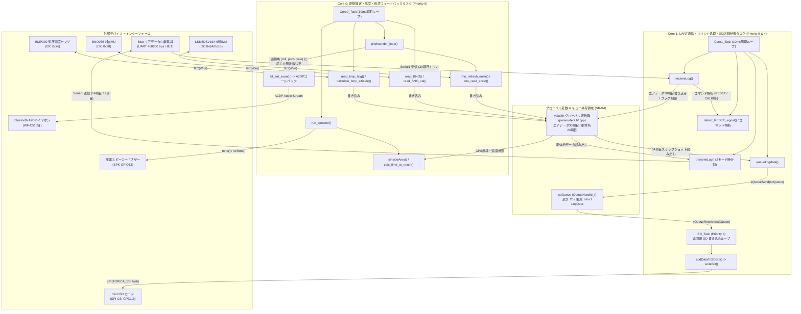

# 26th_fuselage_fm 総合仕様書・システム設計概要

**プロジェクト**: 26th_Software_Fuselage (`26th_fuselage_fm`)  
**対象ハードウェア**: ESP32 Devkit 32E (3.3V / デュアルコア FreeRTOS マイコン)  
**役割**: 鳥人間コンテスト・人力プロペラ機（または滑空機）における **「胴体桁電装基板 (Fuselage Board)」** のメインソフトウェア。  
**更新日**: 2026年7月

---

## 1. システム全体概要

本プロジェクト `26th_fuselage_fm.ino` は、ESP32 Devkit 32E のデュアルコア (Core 0 / Core 1) と FreeRTOS の機能性を最大限に活用し、**高精度な姿勢推定・生データ記録・エアデータ中継・パイロットへの音声／ブザーフィードバック**を並行・リアルタイムに処理する中核システムです。

### 主なシステム機能
1. **6軸IMU (LSM6DSV16X) 姿勢推定 & Bluetooth A2DP 音声フィードバック (Core 0)**
   - 6軸IMU LSM6DSV16X (I2C) から加速度・クォータニオンを取得し、機体のピッチ角 (`roll`, `pitch`, `yaw`) を計算。
   - ピッチ角の状態 (`TAIL_UP`, `LEVEL`, `TAIL_DOWN`) に応じて音程と断続間隔を変更し、Bluetooth A2DP 経由でパイロットのワイヤレスイヤホン (`WF-C510` 等) へリアルタイムなピッチ音フィードバックを提供 (`pitchsender_wrapper.cpp`, `MyBluetooth.cpp`)。
2. **9軸IMU (BNO055) & 気圧センサ (BMP390) データロギング (Core 0)**
   - BNO055 から加速度・クォータニオン・オイラー角およびキャリブレーションステータスを取得。
   - BMP390 から気圧と温度を取得し、気圧高度を計算 (`calculate_bmp_altitude()`)。
3. **進入禁止区域アラート & 最短到達予想時間 (TTC) 警告ブザー (Core 0)**
   - GPS座標（エアデータから受信）と機速・進行方向から、設定されたポリゴン領域（例：にいじゅく未来公園の6頂点）の内外判定 (`isInsideArea()`) および境界線までの最短到達予想秒数 TTC (`calc_time_to_reach()`) を算出。
   - 危険度に応じて車載圧電スピーカー (`SPK`: GPIO13) を鳴らし、パイロットへ警告を発出 (`speaker.cpp`)。
4. **Bico（エアデータ基板）との 460.8kbps 高速 UART 送受信 & コマンド制御 (Core 1)**
   - Bico（通信中継・エアデータ統合基板）から `Serial1` (`460800 bps, 8E1`) で 30項目のエアデータ（気圧高度、超音波高度、対気速度、GPS時刻・座標・速度・方位、差圧、迎角 AoA / 横滑り角 AoS、ICS操舵角、機体下電装データ）を受信し、グローバル `volatile` 変数群へ反映 (`receiveLog()`)。
   - Bico からのコマンド文字列 (`RESET`, `SPK_EN`, `SPK_DIS`, `CHG_TO`, `CALIB`) を瞬時に解析し、各種ステータスやキャリブレーション処理を実行。
   - 逆に、胴体桁基板の IMU・気圧データを 2フレーム時分割マルチプレクスで Bico 基板へ返送 (`transmitLog()`)。
5. **キュー駆動型 SD カード非同期 CSV ロギング (Core 1 / SD_Task)**
   - `Core1_Task` から 100Hz (10ms周期) で全 54項目のデータスナップショットをキュー (`sdQueue`, 20バッファ) に投入 (`queueLogdata()`)。
   - `SD_Task` が非同期にキューからデータを取り出し、SRAM負荷を軽減した 4モード分割形式 (`flash_mode`: 0〜3) で高速 SD 書き込み (`writeSD()`) を達成。

---

## 2. 仕様書ドキュメント目次

本ディレクトリ (`docs/`) には、本システムの全体像、ファイル間関係、タスク設計、データ構造、レイヤー階層を直感的に把握できるように、以下の **全7ドキュメント** を配置しています。

| ドキュメントファイル | 役割・主な収録図解 |
| :--- | :--- |
| **[`README.md`](README.md)** *(本書)* | **総合案内・目次とシステム設計概要** システム全体アーキテクチャ図 (`flowchart TD`) を収録。 |
| **[`01_file_relationships.md`](01_file_relationships.md)** | **ファイル構成とモジュール間の依存関係・結合図** 各ソースファイル (`.ino`, `.h`, `.cpp`) の責務解説、インクルード関係図 (`flowchart TD`)、および `volatile` 変数と `struct LogData` のスレッドセーフ設計解説。 |
| **[`02_core_tasks_flowchart.md`](02_core_tasks_flowchart.md)** | **マルチコア処理・FreeRTOSタスク・キューのフローチャート** `setup()` の初期化シーケンス図 (`sequenceDiagram`) と、`Core0_Task`, `Core1_Task`, `SD_Task` の内部処理フロー・キュー間通信図 (`flowchart TD`)。 |
| **[`03_data_pipeline_flowchart.md`](03_data_pipeline_flowchart.md)** | **データ受信・解析・保存のデータパイプライン関数関係図** Bico UART 受信 -> 解析 -> グローバル反映 -> キュー投入 -> SD 4分割書き込みのデータパイプライン (`flowchart TD`)、および 54項目マッピング表とヘッダー書込の工夫。 |
| **[`04_web_command_flowchart.md`](04_web_command_flowchart.md)** | **時分割配信・コマンド制御・フィードバック警報制御詳細** `transmitLog` による時分割マルチプレクス送信図 (`flowchart TD`)、Bico コマンド (`RESET`/`SPK_EN`/`CALIB` 等) シーケンス図 (`sequenceDiagram`)、ピッチ A2DP 音声＆進入禁止区域アラート回路・制御フロー図 (`flowchart TD`)。 |
| **[`06_layer_hierarchy_flowchart.md`](06_layer_hierarchy_flowchart.md)** | **4層のレイヤー構造・関数ヒエラルキーと処理関係図** 全関数とデータ変数を Layer 3 (抽象データロジック層) 〜 Layer 0 (物理ハードウェア・RTOSカーネル層) に分類した厳密な階層アーキテクチャ図 (`flowchart TD`)。 |
| **[`05_drawio_mermaid_snippets.md`](05_drawio_mermaid_snippets.md)** | **draw.io 貼り付け専用の純粋な Mermaid コード集** 本書および上記 ①～⑥ に記載された全 Mermaid 図のコードブロックのみを抽出したコピー＆ペースト専用リファレンス。 |

---

## 3. システム全体アーキテクチャ図

以下は、外部ハードウェア (Bicoエアデータ基板、Bluetoothイヤホン、圧電スピーカー、SDカード)、ESP32 デュアルコアタスク (`Core0_Task`, `Core1_Task`, `SD_Task`)、FreeRTOS キュー (`sdQueue`)、そしてグローバル共有データ (`volatile` 変数群 / `LogData`) の連携構造を示す全体アーキテクチャ図です。

---

## 4. ハードウェア・ピンマップ一覧 (ESP32 Devkit 32E)

`fslg_config.h / .cpp` で定義されているピン割り当ては以下の通りです。

| 機能・名称 | GPIO ピン番号 | 接続先デバイス・役割 | 備考 |
| :--- | :--- | :--- | :--- |
| **`SerialTX`** | GPIO 33 | Bico 基板 (`Serial1` TX) | 460800 bps, 8E1 (偶数パリティ) |
| **`SerialRX`** | GPIO 32 | Bico 基板 (`Serial1` RX) | 460800 bps, 8E1 |
| **`I2C_SDA`** | GPIO 21 | `Wire` I2C SDA | LSM6DSV16X, BNO055, BMP390 共有 I2C |
| **`I2C_SCL`** | GPIO 22 | `Wire` I2C SCL | I2C クロック 400kHz |
| **`SD_CS`** | GPIO 16 | microSD カード SPI チップセレクト | `TORICA_SD` クラスによる制御 |
| **`SD_SCK`** | GPIO 18 | microSD カード SPI クロック | SPI バス共有 |
| **`SD_MOSI`** | GPIO 23 | microSD カード SPI Master Out | SPI バス共有 |
| **`SD_MISO`** | GPIO 19 | microSD カード SPI Master In | SPI バス共有 |
| **`SPK`** | GPIO 13 | 圧電スピーカー / ブザー | `tone()` / `noTone()` による警報音出力 |
| **`LED1`** | GPIO 3 / 4 | SD 動作インジケータ LED | SD 書き込み中 (`writeSD()`) に点灯・消灯制御 |
| **`LED2`** | GPIO 25 | UART 受信インジケータ LED | Bico 正常受信 (`readnum_bico == 30`) 時に HIGH |
